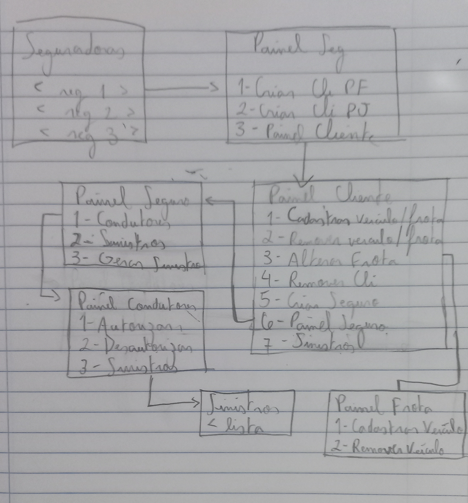

## App Seguradora

Aqui eu explicarei certos aspectos do programa que eu acho que merecem menção. A maior parte do programa foi baseado no UML fornecido no lab05, não irei abordar esses métodos.

## Menu Interativo

O menu interativo é uma parte muito complexa do projeto. O seu funcionamento está espalhado no arquivo `Main.java` (não o Menu!), com diversos métodos relacionados entre si e amarrados por um loop while(true). As seguintes estruturas são importantes:

### `Operacao.java`

É uma enum que contém diversas operações que podemos executar no menu. Ela é extremamente básica e só serve para melhorar a legibilidade do código e a comunicação entre os métodos da `Main.java` (minimamente).

### `Opcao.java`

Esta classe se refere às opções (ou itens) que são listados no menu interativo. Uma Opcao consiste basicamente de:

- `codigo`: Um número inteiro, aquele que o usuário do menu utiliza para selecionar os itens;
- `descricao`: Uma string que descreve o que essa opção significa;
- `operacao`: Um valor da enum `Operacao.java`, que, como já disse, só serve para legibilidade e comunicação entre métodos.

### `Menu.java`

Esta classe se refere ao próprio menu que está sendo exibido no momento. Um Menu consiste de um título, que será exibido ao topo, uma coleção de Opções, que estão numeradas e exibidas pro usuário selecionar, e a opção voltar, que novamente, só serve para comunicação entre os métodos.

- `titulo`: é uma string qualquer;
- `ArrayList<Opcao>`: São objetos da classe `Opcao` e contém todas as opções do Menu exceto a de voltar;
- `voltar`: Um objeto `Opcao` cuja a `Operacao` é VOLTAR.

## Navegando no Menu Interativo

Eu construi o meu baseado no esquema abaixo que desenhei no meu caderno. O Desenho não inclui telas de seleção e cadastro que aparecem entre os paineis, é só um esboço de como o uruário percorrerá o programa. Cada um desses retângulos equivalem a um `Menu`, e cada item deles é uma `Opcao`.   

## Contruindo um `Menu`

Ao invés de usar o construtor diretamente, eu crei uma série de métodos estáticos que chamam o construtor para construir o `Menu` apropriado considerando em que parte do `Menu` em que o usuário está. Esses métodos possuem os prefixos:

- `painel`: O Painel exibe um `Menu` onde o usuário pode ver opções relacionadas a uma INSTÂNCIA de um objeto. O painel do `Cliente` fala de um cliente ESPECÍFICO, o painel da `Frota` fala de uma frota ESPECÍFICA, e assim por diante.
- `selecao`: A Seleção exibe um `Menu` onde cada `Opcao` é um objeto de uma LISTA. O ponto desse `Menu` é selecionar um objeto para aí sim levar o usuário ao painel do determinado objeto, ou então remover aquele objeto, ou selecionar o objeto necessário para o cadastro de outro objeto.

A vantagem da classe `Menu` é que eu posso definir se uma `Opcao` será construída ou não com base na situação atual do sistema. Não posso gerar sinistros sem condutores, não posso criar seguros sem clientes, então eu posso omitir uma `Opcao` inapropriada implementando um pouco de lógica na hora de construir o `Menu`.

## `mostrar()`

Este método simplesmente mostra as opções, e adiciona o prompt `Pressione outras teclas para voltar...`.

## `selecionarOpcao()`

este método recebe um número do usuário e devolve a opção escolhida usando a posição no `ArrayList<Opcao>` como referência.

## Métodos da `Main`

A `Main.java` possui dezenas de métodos que efetivamente realizam as operações selecionadas pelo usuário. Os métodos `criar...`,
`gerar...`, `autorizar...`, recebem uma série de informações do usuário para criar o objeto apropriado. Geralmente, após criar um objeto, entramos no painel dele. As funções `abrirPainel...` estão encarregadas de construir o painel com base no objeto. Painéis estão amarrados por um loop while(true), que só é quebrado caso precisemos voltar para um painel anterior ou sair do programa. O `Menu` é reconstruído a cada loop para que ele possa atualizar. Os métodos `selecionar...`, `remover...`, `desautorizar...` são geralmente telas onde uma lista de objetos será exibida para seleção, e após isso o usuário entrará em algum painel.

## `auto.txt`

Este arquivo de texto foi feito para passear pelos menus a procura de bugs. Eu não fiz testes extensivos com ele, mas pelo menos nos casos deste arquivo o funcionamento do menu interativo parece normal. Eu consegui criar, selecionar e remover objetos, testar validade dos inputs e fazer um uso básico dele. Não garanto que esteja livre de bugs.

## `Leitura`

Esta classe simplesmente lê uma string do usuário e aplica uma `Validacao`.

## `testeClasses()`

Realiza os testes das classes conforme pedido no lab05.